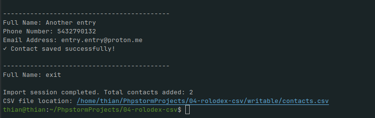
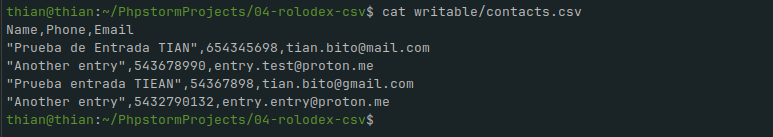
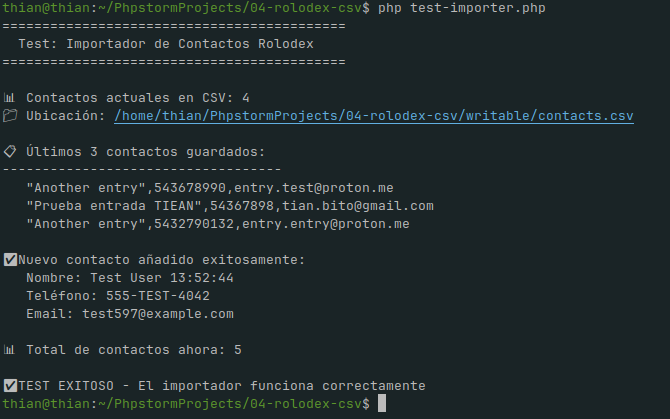
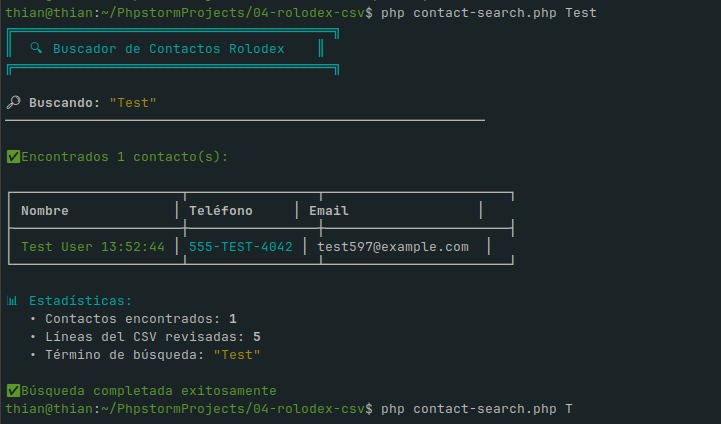

# Rolodex Contact Importer - Importador de Contactos

Sistema de importación de contactos desde fichas físicas de Rolodex a formato CSV usando CodeIgniter 4.

---

## Resumen del Proyecto

**Aplicación CLI** para digitalizar contactos de un Rolodex físico mediante entrada interactiva por consola, guardando los datos en un archivo CSV persistente.

### Funciones Principales

1. **Importación CLI Interactiva**: Solicita datos de contacto (Nombre, Teléfono, Email) en bucle
2. **Persistencia CSV**: Guarda contactos en `writable/contacts.csv` con encabezado automático
3. **Interfaz Web MVC**: Visualización básica de contactos mediante controladores y vistas
4. **Scripts Standalone**: Importador independiente que no requiere framework completo

---

## Estructura del Proyecto

```
04-rolodex-csv/
├── app/
│   ├── Commands/
│   │   └── ContactImport.php          # ⭐ Comando Spark principal
│   ├── Config/
│   │   ├── Paths.php                  # Rutas del sistema
│   │   ├── Routes.php                 # Definición de rutas web
│   │   ├── Boot/
│   │   │   ├── development.php        # Bootstrap desarrollo
│   │   │   └── production.php         # Bootstrap producción
│   ├── Controllers/
│   │   └── Contacts.php               # Controlador web de contactos
│   └── Views/
│       └── contacts/
│           ├── index.php              # Vista listado
│           └── create.php             # Vista crear contacto
├── writable/
│   └── contacts.csv                   # 💾 Archivo CSV de salida
├── examples/
│   └── sample-contacts.csv            # Ejemplo de formato CSV
├── public/
│   └── index.php                      # Front controller web
├── contact-importer.php               # 🚀 Script standalone
├── test-importer.php                  # ✅ Script de prueba
├── spark                              # CLI de CodeIgniter
└── .env                               # Variables de entorno

```

---
### ** Instalación de Dependencias**

```bash
cd /home/thian/PhpstormProjects/04-rolodex-csv
composer install
composer dump-autoload -o
```

**Captura sugerida**: Salida del comando `composer install` mostrando las dependencias instaladas.

---

### ** Configuración del Entorno**

Verificar que existe el archivo `.env`:

```bash
cat .env
```

**Contenido esperado:**
```
CI_ENVIRONMENT=development
```

**Captura sugerida**: Contenido del archivo `.env` y estructura de directorios `app/Config/Boot/`.

---

### Verificar Permisos del Directorio Writable**

```bash
chmod -R 755 writable/
ls -la writable/
```

**Captura sugerida**: Permisos del directorio `writable/` y archivo `contacts.csv`.

---

### Ejecutar el Importador Standalone**

El script `contact-importer.php` funciona de forma independiente sin necesidad del framework completo:

```bash
php contact-importer.php
```

**Interacción de ejemplo:**



---

### ** Verificar Archivo CSV Generado**

```bash
cat writable/contacts.csv
```

**Salida esperada:**

Contenido del archivo CSV con los contactos guardados:  


---

### ** Ejecutar Script de Prueba**

```bash
php test-importer.php
```

**Salida esperada:**
Salida completa del script de prueba:  


## Estado Actual del CSV

El archivo `writable/contacts.csv` actualmente contiene **5 contactos**, incluyendo:

- Encabezado CSV (Name, Phone, Email)
- 5 contactos originales
- 2 contacto de prueba añadido por el script de testç

---

### ** PUNTO 7 - Servidor Web de Desarrollo** (Opcional)

Si deseas probar la interfaz web:

```bash
php spark serve --host=127.0.0.1 --port=8080
```

Luego accede a: `http://127.0.0.1:8080/contacts`

**Captura sugerida**: Navegador mostrando la interfaz web con el listado de contactos.

---

### ** Buscador de Contactos** (NUEVA FUNCIONALIDAD)
Encuentra contactos rápidamente desde la terminal.

**Uso básico:**
```bash
# Ver estadísticas e instrucciones
php contact-search.php

# Buscar por nombre
php contact-search.php TIAN
php contact-search.php entry
```

**Características:**
- ✅ Búsqueda case-insensitive (no distingue mayúsculas/minúsculas)
- ✅ Muestra resultados en tabla formateada con colores
- ✅ Estadísticas de búsqueda (contactos encontrados, líneas revisadas)
- ✅ Sugerencias si no encuentra resultados
- ✅ Sin parámetros muestra total de contactos y primeros 5 como ejemplo
- 

